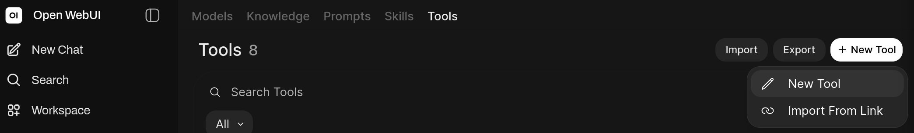
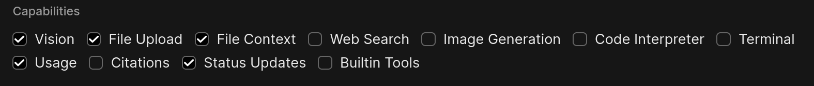

# owuinc

[](https://github.com/Soakedcardinal/owuinc/actions/workflows/ci.yml)

Connect OpenWebUI Models to Nextcloud.

## Features

### File Operations
*   `mkdir`, `ls`, `find`, `stat`, `tree`, `grep`, `edit`, `mv`, `cp`, `rm`
*   `write`, `cat`, `append`

### Task Management
*   Create, read, edit, delete, & complete tasks
*   Support sub-tasks

### Calendar Events
*   Create, read, edit, & delete events
*   Support for recurring events
*   Support Alarms

## Security
*   **Configurable Sandbox**: Prevent the model from accessing unauthorized directories.

## Setup

Pick an existing model, or create one to use. For this example, we will set up a model named `owuinc`.

### 1. Add the `owuinc` Tool to OpenWebUI

*   Navigate to Workspace > Tools > + New Tool > New Tool



*   Enter Name and description e.g. `owuinc`
*   Paste the contents of [`owuinc.py`](./owuinc/owuinc.py)
*   Click Save > Confirm

### 2. Configure Valves
*   Under Profile Icon > Personal Settings > Security, create an app password e.g. `owuinc`
*   In NextCloud Files app > Files settings, find your WebDAV URL `https://your-nextcloud-domain.com/remote.php/dav/files/<WEBDAV_USERNAME>` and copy the `<WEBDAV_USERNAME>` portion
*   In OpenWebUI > gear icon next to `owuinc` tool > fill in the Valves
    *   `Webdav Username` (from above)
    *   `Nextcloud Base URL` (nextcloud server address)
    *   `Nextcloud Username` (shown above app password)
    *   `Nextcloud App Password`
*   Press save

The other valves default to:
* sandbox: `owuinc`
* Calendar: `Personal`
* Task list: `Tasks`

Change them if you want to use different (isolated) calendar or task list.

> **Note**: If you change the default calendar or task list, you must also update the respective whitelist valve.

### 3. Configure Model
*   OpenWebUI > Workspace > Models > `owuinc`
*   Add to the system prompt

```text
Task Priorities: 1 = high, 9 = low, 0 = none
Calendar Functions: Provide `start` and `end` arguments as an ISO 8601-style string without a timezone offset, e.g. `2026-02-01T15:30`.
Default `calendar_name`: `Personal`
Default `list_name`: `Tasks`
```

> **Note**: Update the defaults in the prompt if you changed the calendar or task list valves in Step 2.

*   Ensure Advanced Params > Show > Function Calling is set to `Native`
*   Under Capabilities, match the following settings:
    
    Built-in tool schemas add significant overhead that can interfere with owuinc function reliability. You can re-enable individual capabilities later if needed, but reliability is not guaranteed with additional schemas enabled.
*   Under Tools, tick the checkbox to enable the `owuinc` tool
*   Press Save & Update

## Inject Nextcloud Files as System Instructions (Optional)

The [`startup_context_injector`](./startup_context_injector.py) filter auto-injects files of your choosing as system instructions on the first turn, enabling **self-improvement** and **persistent memory**, and other advanced agentic behavior.

To use, paste the file into OpenWebUI Admin Panel > Functions > + New Function and configure the Valves (similar to `owuinc`) and define what files to inject. The filter handles automatic daily memory log injection from `memory/`. For a starting point, refer to [OpenClaw templates](https://docs.openclaw.ai/reference/templates/AGENTS).

## Contributing

Contributions are welcome. Fork the repo and open a PR against the `staging` branch — every PR requires maintainer review and green CI before merging to `main`. See [CONTRIBUTING.md](./CONTRIBUTING.md) for setup and house rules.

<br>

---

<br>

[](https://www.buymeacoffee.com/soakedcardinal)


monero:89xxpMUUjddM1EVg8288BHCRqJZ3KxUXnaazscKJTkHc1PkU5jL4Zrqe4gaLry5XdCc9hRasK6a2SR4SHf87bF7RVTAA6X5
