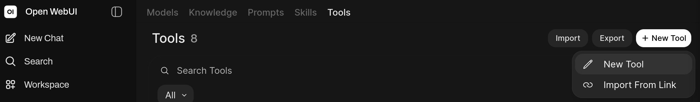
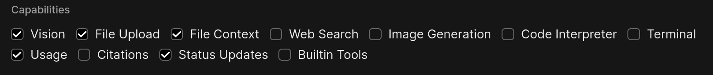

# owuinc

[](https://github.com/Soakedcardinal/owuinc/actions/workflows/ci.yml)

Connect OpenWebUI Models to Nextcloud.

# Features

## File Operations

- `mkdir`, `ls`, `find`, `stat`, `grep`, `edit`, `mv`, `cp`, `rm`
- `write`, `cat`, `append`

## Tasks

- `task_lists`, `tasks`, `add_task`, `edit_task`, `complete_task`, `delete_task`

## Calendar

- `calendars`, `calendar_events`, `create_calendar_event`, `edit_calendar_event`, `delete_calendar_event`

# Setup

Pick an existing model, or create one to use. For this example, we will set up a model named `owuinc`.

## 1. Add the `owuinc` Tool to OpenWebUI

- Navigate to Workspace > Tools > + New Tool > New Tool



- Enter Name and description e.g. `owuinc`
- Paste the contents of [`owuinc.py`](./owuinc/owuinc.py)
- Click Save > Confirm

## 2. Configure Valves

- Under Profile Icon > Personal Settings > Security, create an app password e.g. `owuinc`
- In NextCloud Files app > Files settings, find your WebDAV URL `https://your-nextcloud-domain.com/remote.php/dav/files/<WEBDAV_USERNAME>` and copy the `<WEBDAV_USERNAME>` portion
- In OpenWebUI > gear icon next to `owuinc` tool > fill in the Valves
  - `Webdav Username` (from above)
  - `Nextcloud Base URL` (nextcloud server address)
  - `Nextcloud Username` (shown above app password)
  - `Nextcloud App Password`
- Press save

The other valves default to:
- sandbox: `owuinc`
- Calendar: `Personal`
- Task list: `Tasks`

Change them if you want to use different (isolated) calendar or task list.

> **Note**: If you change the default calendar or task list, you must also update the respective whitelist valve.

## 3. Configure Model

- OpenWebUI > Workspace > Models > `owuinc`
- Add to the system prompt

```text
Task Priorities: 1 = high, 9 = low, 0 = none
Calendar Functions: Provide start and end arguments as an ISO 8601-style string without a timezone offset, e.g. 2026-02-01T15:30.
Default calendar_name: Personal
Default list_name: Tasks
```

> **Note**: Update the defaults in the prompt if you changed the calendar or task list valves in Step 2.

- Ensure Advanced Params > Show > Function Calling is set to `Native`
- Under Capabilities, match the following settings:



  Built-in tool schemas add significant overhead that can interfere with owuinc function reliability. You can re-enable individual capabilities later if needed, but reliability is not guaranteed with additional schemas enabled.

- Under Tools, tick the checkbox to enable the `owuinc` tool
- Press Save & Update

# Context Injector

The [`startup_context_injector`](./startup_context_injector.py) filter injects your Nextcloud files into the system prompt each generation. The agent's identity, rules and memory live in files it reads and writes itself; daily memory logs are injected automatically, so state outlives a single chat. The tool's configurable sandbox keeps it from touching directories outside its own.

**Example:** *"log my training session from today and schedule a reminder for Thursday."* The agent appends the session to `notes/fitness/training.md`, creates a calendar event with an alarm, and adds a line to `memory/<today>.md`. The injector feeds that log into the next session's prompt. All data stays on your server.

**Setup:** paste the file into OpenWebUI Admin Panel > Functions > + New Function, then fill the Valves (same credentials as `owuinc`):
- `FILES_TO_INJECT`: sandbox files to inject, in order (default: `AGENTS.md,SOUL.md,IDENTITY.md,TOOLS.md,STYLE.md,USER.md,MEMORY.md`)
- `INJECT_TODAY` / `INJECT_YESTERDAY` / `INJECT_2_DAYS_AGO`: daily logs from `memory/`
- `FILE_BLACKLIST`: paths never read or injected (match the `owuinc` tool's valve)


<br>

## Donate

[Donate](./DONATE.md)
